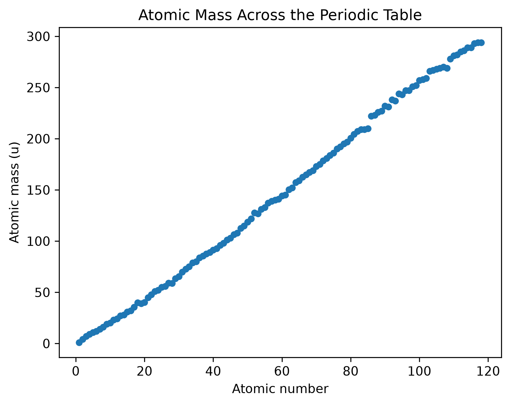

# Au: Exploring the Elements with Python

## Data preparation
- Preserved the original CSV.
- Restricted analysis to atomic numbers 1–118.
- Identified missing density, melting-point, and boiling-point values.
- Converted gas densities from g/L to g/cm³ in a new column.

Source: [Bowserinator's Periodic Table dataset](https://github.com/Bowserinator/Periodic-Table-JSON).

- `data/elements.csv`: Original CSV preserved as downloaded.
- `data/elements_prepared.csv`: Prepared dataset containing atomic
  numbers 1–118 and a new `density_g_cm3` column.

The source reports gas densities in g/L and solid/liquid densities
in g/cm³. Gas densities were divided by 1,000 to standardize them
to g/cm³.

Missing values remain missing. Some source properties are predicted
or uncertain; preparation does not verify their scientific accuracy.

## Data limitations
Some populated properties are not verified measurements.
For example, this dataset lists Hassium's density as 40.70 g/cm³,
while the Royal Society of Chemistry lists it as unknown.
Density rankings therefore describe the dataset's recorded values,
not a verified ranking of measured densities.

Reference: https://periodic-table.rsc.org/element/108/

## Finding 1: Atomic number and atomic mass

The scatter plot shows a strong positive relationship between atomic
number and the dataset's atomic mass values. The overall trend rises,
with small irregularities.

Atomic mass gives us the most coverage because there are zero missing missing properties. Boiling point gives us the least coverage because there are 14 elements that have that property missing.
