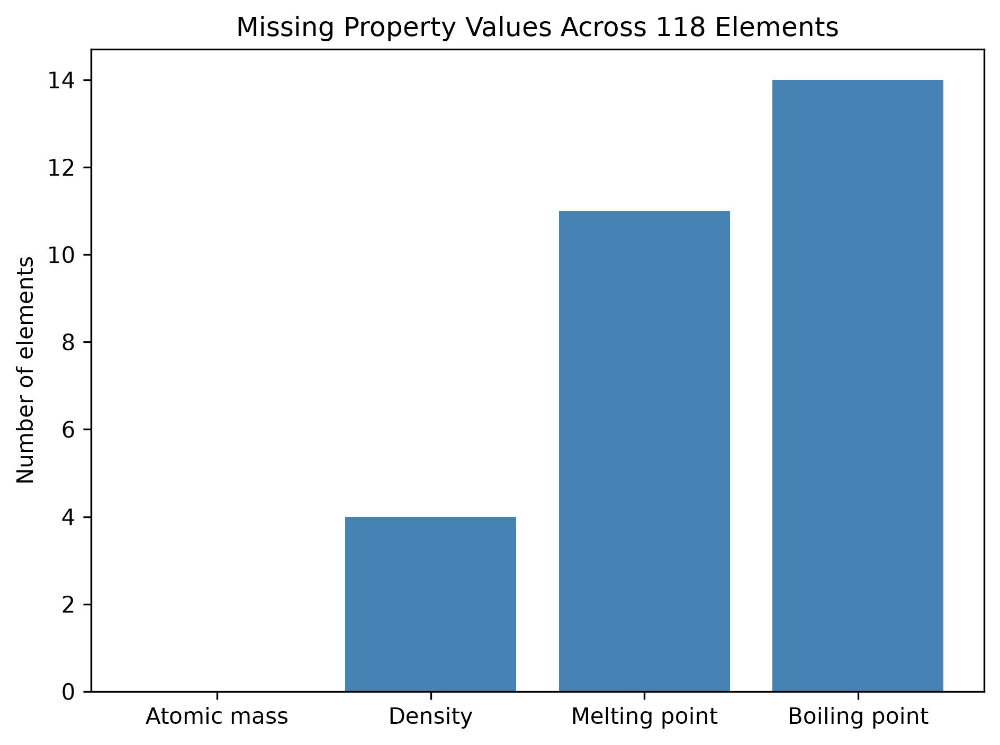
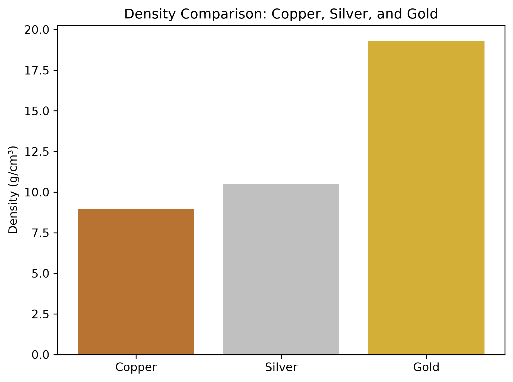

# Au: Exploring the Elements with Python

## Data preparation
- Preserved the original CSV.
- Restricted analysis to atomic numbers 1–118.
- Identified missing density, melting-point, and boiling-point values.
- Converted gas densities from g/L to g/cm³ in a new column.

## Data limitations
Some populated properties are not verified measurements.
For example, this dataset lists Hassium's density as 40.70 g/cm³,
while the Royal Society of Chemistry lists it as unknown.
Density rankings therefore describe the dataset's recorded values,
not a verified ranking of measured densities.

Reference: https://periodic-table.rsc.org/element/108/

## Finding 1: Atomic number and atomic mass

The scatter plot shows a strong positive relationship between atomic
number and the dataset's atomic mass values. The overall trend rises,
with small irregularities.

Atomic mass gives us the most coverage because there are zero missing missing properties. Boiling point gives us the least coverage because there are 14 elements that have that property missing.

Finding 2: Missing property values

Atomic mass is available for all 118 elements. Density is missing
for 4 elements, melting point for 11, and boiling point for 14.

Boiling point has the least complete coverage: 104 of 118 elements.
Missing values were preserved rather than replaced with zero.
Complete coverage does not guarantee that every value is accurate.

## Finding 3: Comparing copper, silver, and gold

Among these three elements, gold has the highest recorded density:

| Element | Density (g/cm³) |
|---|---:|
| Copper | 8.96 |
| Silver | 10.49 |
| Gold | 19.30 |

For equal volumes, the recorded values imply that gold has about
2.15 times the mass of copper.

